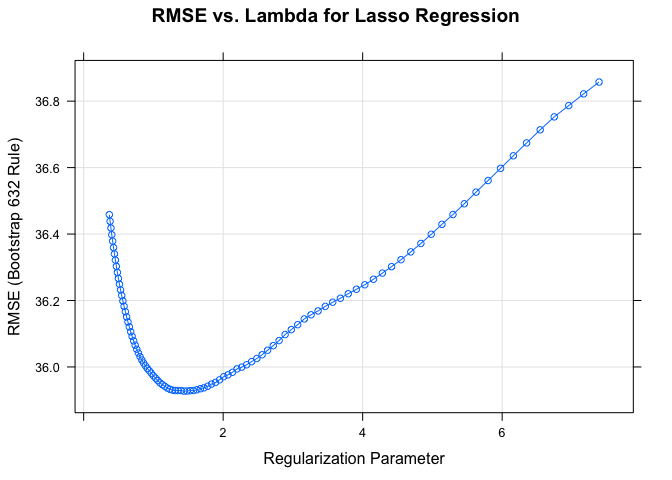

Model Comparison using 632 Bootstrap Cross Validation
================
Adeline Shin (as5951)

# Introduction

In the US, high cholesterol is a common health problem, affecting more
than 12% of adults over the age of 20, according to the CDC. This data
on cholesterol was collected as a part of the NHANES database, which
consists of answers to a national survey conducted on nutrition and
health behavior among Americans.

Our group used the NHANES data to predict cholesterol based on
demographic, dietary, laboratory, and questionnaire data from the
surveys conducted during 2015-2016. We picked a combination of 63
potential predictors from these categories in order to cover potential
social, behavioral, and genetic determinants of the outcome variable,
LDL cholesterol levels. We were interested in determining which model
type was the most effective in predicting cholesterol levels given
values for all other predictors.

# Methods

The 63 variables as potential predictors were chosen by looking at the
entirety of the NHANES dataset. Based on our research on causes of high
cholesterol levels, we decided to pick variables across all sections of
the NHANES dataset. The chosen variables are listed in Appendix A1,
along with their variables names and categories.

Using these 63 variables, we first separated the data into training and
test data using an 80/20 split. The training data was used to generate
the models, and the test data was used to compare to the predicted
values from the models. Using the RMSE calculated between the test data
and the predicted data, we were able to compare which method had the
lowest RMSE value, and therefore the best predictive abilities.

In this project, the caret package in R was used to train all the
models, and thus, the models compared were a linear model, a ridge
regression model, a lasso model, and an elastic net model with an alpha
value of 0.75. Our group members decided to use different
cross-validation methods in order to see whether that would make a
difference in terms of the final chosen model. In the models below, the
632 bootstrap cross-validation method was used, while other team members
chose to use Monte Carlo cross-validation or leave one out
cross-validation.

# Results

## Linear Model

    ## 
    ## Call:
    ## lm(formula = .outcome ~ ., data = dat)
    ## 
    ## Residuals:
    ##     Min      1Q  Median      3Q     Max 
    ## -92.028 -20.977  -2.615  16.785 126.993 
    ## 
    ## Coefficients: (4 not defined because of singularities)
    ##               Estimate Std. Error t value Pr(>|t|)    
    ## (Intercept)  2.325e+02  1.218e+02   1.909 0.056847 .  
    ## X1          -1.261e-02  1.102e-02  -1.144 0.253069    
    ## seqn        -8.106e-04  5.814e-04  -1.394 0.163928    
    ## urxuma       1.135e-02  7.417e-03   1.530 0.126745    
    ## urxucr       1.951e-02  2.694e-02   0.724 0.469365    
    ## lbxsapsi     1.330e-01  8.202e-02   1.621 0.105662    
    ## lbxsc3si    -3.593e-01  8.218e-01  -0.437 0.662152    
    ## lbxsgl       8.670e-02  5.456e-02   1.589 0.112787    
    ## lbxsgb       9.589e+00  4.578e+00   2.094 0.036779 *  
    ## lbxsgtsi     1.760e-02  4.760e-02   0.370 0.711712    
    ## lbxsldsi    -1.163e-01  6.227e-02  -1.867 0.062507 .  
    ## lbxsph       7.853e+00  3.717e+00   2.113 0.035149 *  
    ## lbxsksi     -3.476e+00  5.380e+00  -0.646 0.518458    
    ## lbxstb       3.708e+00  6.914e+00   0.536 0.591983    
    ## lbxsua       1.957e+00  1.501e+00   1.304 0.192811    
    ## lbxlypct    -9.887e-01  8.389e-01  -1.179 0.239204    
    ## lbxmopct    -2.096e+00  1.231e+00  -1.703 0.089243 .  
    ## lbxnepct    -1.498e+00  7.935e-01  -1.888 0.059624 .  
    ## lbxhgb      -2.535e+00  5.005e+00  -0.506 0.612758    
    ## lbxhct       2.030e+00  1.737e+00   1.169 0.243130    
    ## lbxhscrp     3.741e-01  2.121e-01   1.764 0.078414 .  
    ## bmxbmi      -1.629e-01  5.881e-01  -0.277 0.781900    
    ## bmxwaist     2.760e-02  2.684e-01   0.103 0.918125    
    ## bpxsy        1.217e-01  1.074e-01   1.134 0.257446    
    ## bpxdi        2.303e-01  1.445e-01   1.594 0.111720    
    ## dbd1002     -2.275e+00  3.824e+00  -0.595 0.552148    
    ## dbd1003     -6.254e+00  4.734e+00  -1.321 0.187088    
    ## drqsprep2    4.716e+00  9.196e+00   0.513 0.608334    
    ## drqsprep3    3.534e+00  8.526e+00   0.414 0.678711    
    ## drqsprep4    8.786e+00  8.329e+00   1.055 0.292080    
    ## drqsdiet2    2.284e+00  4.626e+00   0.494 0.621729    
    ## dr1tnumf     1.681e-01  3.378e-01   0.498 0.618860    
    ## dr1tkcal    -8.804e-02  1.082e-01  -0.813 0.416437    
    ## dr1tprot     3.874e-01  4.691e-01   0.826 0.409402    
    ## dr1tcarb     3.238e-01  4.515e-01   0.717 0.473707    
    ## dr1tsugr     3.380e-02  6.673e-02   0.506 0.612759    
    ## dr1tfibe    -5.408e-02  3.194e-01  -0.169 0.865649    
    ## dr1ttfat     7.785e-01  9.571e-01   0.813 0.416429    
    ## dr1tcaff     1.066e-02  7.751e-03   1.375 0.169934    
    ## dr1talco     4.366e-01  7.550e-01   0.578 0.563403    
    ## dr1_3002    -4.585e+00  6.861e+00  -0.668 0.504338    
    ## dr1_3003    -3.940e+00  7.752e+00  -0.508 0.611548    
    ## dr1_320z     6.703e-04  1.642e-03   0.408 0.683310    
    ## drd3402     -3.753e+00  3.503e+00  -1.071 0.284536    
    ## drd3602     -2.410e-03  4.033e+00  -0.001 0.999523    
    ## ds1dscnt     2.447e-02  8.302e-01   0.029 0.976496    
    ## ds1ancnt    -7.094e+00  8.244e+00  -0.860 0.389988    
    ## cbd071       1.688e-03  3.365e-03   0.502 0.616231    
    ## cbd121       1.225e-03  9.726e-03   0.126 0.899844    
    ## cbd131       6.696e-03  3.597e-02   0.186 0.852411    
    ## dbd895      -5.133e-01  5.577e-01  -0.920 0.357853    
    ## bpq0202      7.158e+00  3.849e+00   1.860 0.063564 .  
    ## cdq0012      3.591e-01  3.966e+00   0.091 0.927896    
    ## hsd0102     -2.168e+00  6.784e+00  -0.320 0.749410    
    ## hsd0103     -3.840e+00  6.908e+00  -0.556 0.578513    
    ## hsd0104     -9.790e+00  7.622e+00  -1.285 0.199615    
    ## hsd0105     -2.103e+01  1.337e+01  -1.573 0.116380    
    ## diq0102      1.982e+01  5.617e+00   3.529 0.000461 ***
    ## diq0103      1.807e+01  9.718e+00   1.859 0.063620 .  
    ## dbq7002      1.017e+01  6.301e+00   1.614 0.107265    
    ## dbq7003      9.099e+00  5.932e+00   1.534 0.125737    
    ## dbq7004      1.276e+01  6.500e+00   1.963 0.050287 .  
    ## dbq7005      2.240e+01  8.801e+00   2.546 0.011244 *  
    ## fsd032a2     1.725e+00  7.579e+00   0.228 0.820047    
    ## fsd032a3     2.247e+00  1.455e+01   0.154 0.877306    
    ## fsd032c2    -1.277e+00  9.136e+00  -0.140 0.888935    
    ## fsd032c3     5.113e-01  1.047e+01   0.049 0.961052    
    ## fsdhh2      -4.303e+00  1.275e+01  -0.338 0.735838    
    ## fsdhh3      -6.573e+00  1.775e+01  -0.370 0.711273    
    ## fsdhh4       3.413e+00  1.943e+01   0.176 0.860591    
    ## hiq011      -4.935e+01  3.884e+01  -1.271 0.204510    
    ## hiq2702      2.398e+00  6.267e+00   0.383 0.702230    
    ## paq6052     -2.160e+00  4.204e+00  -0.514 0.607622    
    ## smq0202      5.251e-02  3.561e+00   0.015 0.988242    
    ## riagendr2    4.047e+00  5.252e+00   0.771 0.441379    
    ## ridageyr    -4.537e-01  2.007e-01  -2.260 0.024293 *  
    ## ridreth12    9.757e+00  6.681e+00   1.460 0.144876    
    ## ridreth13    1.309e+01  6.036e+00   2.169 0.030641 *  
    ## ridreth14    9.250e-01  6.641e+00   0.139 0.889297    
    ## ridreth15    1.558e+01  1.188e+01   1.312 0.190363    
    ## ridreth32           NA         NA      NA       NA    
    ## ridreth33           NA         NA      NA       NA    
    ## ridreth34           NA         NA      NA       NA    
    ## ridreth36   -1.954e+01  1.376e+01  -1.421 0.156118    
    ## ridreth37           NA         NA      NA       NA    
    ## dmdborn42    8.339e+00  5.397e+00   1.545 0.123054    
    ## indfmpir    -2.303e+00  1.360e+00  -1.693 0.091081 .  
    ## ---
    ## Signif. codes:  0 '***' 0.001 '**' 0.01 '*' 0.05 '.' 0.1 ' ' 1
    ## 
    ## Residual standard error: 35.08 on 446 degrees of freedom
    ## Multiple R-squared:  0.2521, Adjusted R-squared:  0.1146 
    ## F-statistic: 1.834 on 82 and 446 DF,  p-value: 5.884e-05

As apparent from the summary of the linear model, many of the predictors
are not significant at a 95% significance level. This likely means that
the model does not fit the data well, and therefore, the model would not
predict the value of cholesterol well.

### Prediction using Linear Model

The linear model has an MSE of 900.9163528, which is high, but expected,
as the model itself did not have many significant variables.

## Ridge Regression Model

<!-- -->

As shown on the graph above, the value of lambda that gives the lowest
RMSE value is 34.3071414. The ridge model at this value of lambda gives
86 variables in the final model, which can then be used to predict
cholesterol levels.

### Prediction using Ridge Model

The ridge model gives an MSE of 969.7147027, which is lower than that of
the linear model.

# Lasso Model

<!-- -->

As shown on the graph above, the value of lambda that gives the lowest
RMSE value is 1.438551. The lasso model at this value of lambda gives 32
variables in the final model, which can then be used to predict
cholesterol levels.

### Prediction using Lasso Model

The lasso model gives an MSE of 985.2474791.

## Elastic Net Model

<!-- -->

As shown in the graph above, the elastic net model with an alpha of 0.75
has the lowest RMSE at a lambda value of 1.947734. This combination of
alpha and beta gives a model that contains 33 predictors in the final
model. This model is then used to predict the cholesterol level and
compared to the test data.

### Prediction using Elastic Net

Prediction of cholesterol levels using the elastic net model gives an
MSE of
989.2835002.

## Model Comparison

<!-- --><!-- -->

As shown in the box plot above, the model created using ridge regression
gives the lowest RMSE among the four models created for the purpose of
predicting cholesterol levels. Therefore, the ridge regression model
should be chosen when using 632 bootstrap as the cross validation
method.
